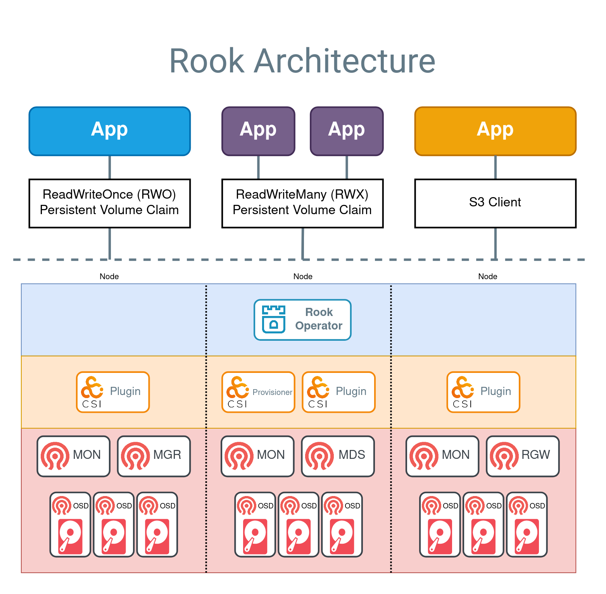

# Object storage

## Ceph and Rook

Ceph is a highly scalable, reliable, and performant open-source distributed storage system that unifies object, block, and file storage within a single unified platform, eliminating vendor lock-in while supporting enterprise workloads across on-premises, cloud, and containerized environments.

Rook is a cloud-native storage orchestrator for Kubernetes that transforms Ceph into self-managing, self-scaling, and self-healing storage services through specialized operators.

Rook Ceph simplifies the deployment, configuration, and management of Ceph clusters within Kubernetes environments, automating complex administration tasks including provisioning, scaling, upgrades, and disaster recovery while enabling organizations to leverage Ceph's powerful storage capabilities with minimal operational overhead.

## Storage types

Ceph exposes three complementary storage types, each suited to a different access pattern.

- Object storage - Ceph Object Gateway (RGW)  
  The Ceph Object Gateway exposes an S3 and Swift-compatible HTTP API on top of the RADOS object store, enabling applications to store and retrieve unstructured data such as files, backups, and artifacts at scale without requiring a mounted filesystem.
- Block storage - Ceph Rados Block Device (RBD)  
  Ceph RADOS Block Device (RBD) provides raw block devices backed by the Ceph cluster, typically used as persistent volumes for databases and stateful applications that require low-latency, single-node read/write access.
- File system storage - Ceph FS  
  CephFS is a POSIX-compliant distributed file system layered on top of Ceph, allowing multiple nodes to mount and concurrently read/write the same storage, unlike block storage which is limited to a single pod at a time. It is well suited for shared data access across multiple applications, such as content management systems, shared file repositories, or collaboration tools.

## Object Storage S3

In the diagram below, the flow to create an application with access to an S3 bucket is:

- The (orange) app creates an ObjectBucketClaim (OBC) to request a bucket
- The Rook operator creates a Ceph RGW bucket (via the lib-bucket-provisioner)
- The Rook operator creates a secret with the credentials for accessing the bucket and a configmap with bucket information
- The app retrieves the credentials from the secret
- The app can now read and write to the bucket with an S3 client

A S3 compatible client can use the S3 bucket right away using the credentials (Secret) and bucket info (ConfigMap).



## Ceph ObjectBucketClaim

An `ObjectBucketClaim` (OBC) is how an application requests an S3 bucket, the same way a `PersistentVolumeClaim` requests a volume. Developers only need to write this one manifest, the Rook Ceph will then create a bucket and an `ObjectBucket`. Make sure the `StorageClass` of the bucket provisioner exists before creating `ObjectBucketClaim`.

```yaml
apiVersion: objectbucket.io/v1alpha1
kind: ObjectBucketClaim
metadata:
  name: ceph-bucket # The name of the Claim, Secret and ConfigMap.
  namespace: rook-ceph # Claim is namespaced.
spec:
  bucketName: # User defied bucket name, not recommended
  generateBucketName: photo-booth # User defined prefix for a randomly generated bucket name, recommended
  storageClassName: rook-ceph-bucket # StorageClass of the bucket provisioner.
  additionalConfig:
    maxObjects: "1000" # The maximum number of objects in the bucket.
    maxSize: "2G" # The maximum size of the bucket.
```

The `ObjectBucketClaim` is created and can be verified through:
`kubectl -n rook-ceph get objectbucketclaims.objectbucket.io ceph-bucket  -o yaml`

```yaml
apiVersion: objectbucket.io/v1alpha1
kind: ObjectBucketClaim
metadata:
  creationTimestamp: "2019-10-18T09:54:01Z"
  generation: 2
  name: ceph-bucket
  namespace: rook-ceph
  resourceVersion: "559491"
spec:
  ObjectBucketName: obc-rook-ceph-ceph-bucket # It generated OB name created using namespace and OBC name.
  additionalConfig:
    maxObjects: "1000"
    maxSize: 2G
  bucketName: photo-booth-c1178d61-1517-431f-8408-ec4c9fa50bee # The generated unique bucket name for the new bucket
  generateBucketName: photo-booth
  storageClassName: rook-ceph-bucket
status:
  phase: Bound # phases of bucket creation
```

The following are phases of bucket creation:

- Pending: the operator is processing the request.
- Bound: the operator finished processing the request and linked the OBC and OB
- Released: the OB has been deleted, leaving the OBC unclaimed but unavailable.
- Failed: not currently set.

## Other provider

- SeaweedFS
- MinIO (no longer an open source project starting 2026)
- AWS S3
- Azure Blob Storage
- GCS

[Reference](https://rook.io/docs/rook/v1.12/Storage-Configuration/Object-Storage-RGW/object-storage/)

---

_The content of this document, including all text, images, and associated materials, is the exclusive property of Adaltas and is protected by applicable copyright laws. Unauthorized distribution, reproduction, or sharing of this content, in whole or in part, is strictly prohibited without the express written consent of the author(s). Any violation of this restriction may result in legal action and the imposition of penalties as prescribed by law._
